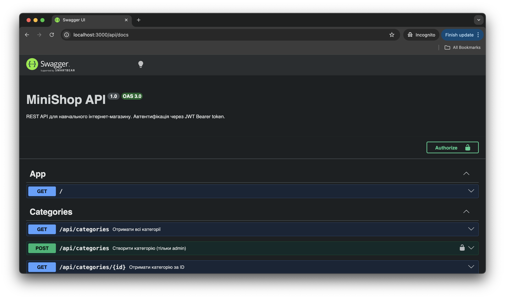

## Student
- Name: Stukalov Nikita
- Group: IM-32

## Практичне заняття №6 — Interceptors + Exception Filters + Swagger

### Структура репозиторію
```
.
├── src/
│   ├── auth/ ...
│   ├── users/ ...
│   ├── categories/ ...
│   ├── products/ ...
│   ├── common/
│   │   ├── enums/
│   │   │   └── role.enum.ts
│   │   ├── guards/
│   │   │   ├── jwt-auth.guard.ts
│   │   │   └── roles.guard.ts
│   │   ├── decorators/
│   │   │   ├── current-user.decorator.ts
│   │   │   └── roles.decorator.ts
│   │   ├── interceptors/
│   │   │   ├── logging.interceptor.ts
│   │   │   └── transform.interceptor.ts
│   │   ├── filters/
│   │   │   └── http-exception.filter.ts
│   │   └── pipes/
│   │       └── trim.pipe.ts
│   ├── migrations/
│   ├── main.ts
│   └── app.module.ts
├── swagger-screenshot.png
├── Dockerfile
├── docker-compose.yml
└── README.md
```

### Запуск проекту
```bash
cp .env.example .env
docker compose up --build
```

### Swagger UI
http://localhost:3000/api/docs



### Формат успішної відповіді
```json
{
  "data": { "..." : "..." },
  "statusCode": 200,
  "timestamp": "2026-05-10T22:25:53.000Z"
}
```

### Формат помилки
```json
{
  "error": {
    "code": 400,
    "message": "Validation failed",
    "details": ["name must be longer than or equal to 2 characters"],
    "traceId": "a1b2c3d4-e5f6-..."
  },
  "timestamp": "2026-05-10T22:25:35.000Z"
}
```

### Приклад логів (LoggingInterceptor)
```text
[Nest] 29  - 05/10/2026, 10:25:45 PM   ERROR [Exception] [ce922842-bc95-4fcf-8a79-6a1b06c49589] POST /api/categories — 401 — Missing authorization token
[Nest] 29  - 05/10/2026, 10:25:53 PM     LOG [HTTP] GET /api/products — 200 — 13ms
```

### Тест помилки з traceId
```text
$ curl http://localhost:3000/api/products/999
{"error":{"code":404,"message":"Product #999 not found","traceId":"1614b7c9-658c-4a84-9d66-060c1394935b"},"timestamp":"2026-05-10T22:26:00.502Z"}
```
